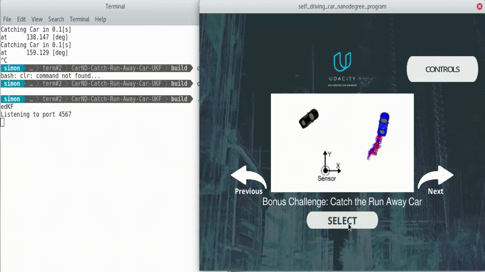

# Run Away Robot with Unscented Kalman Filter Bonus Challenge Starter Code
Self-Driving Car Engineer Nanodegree Program

---

### Result



### Overview

This repository contains all the code needed to complete the Bonus Challenge: Cathc the Run Away Car with Unscented Kalman Filter.

### Project Introduction

In this project, not only do you implement an UKF, but also use it to catch an escaped car driving in a circular path.
The run away car will be being sensed by a stationary sensor, that is able to measure both noisy lidar and radar data. The capture vehicle will need to use these measurements to close in on the run away car. To capture the run away car the capture vehicle needs to come within .1 unit distance of its position. However the capture car and the run away car have the same max velocity, so if the capture vehicle wants to catch the car, it will need to predict where the car will be ahead of time.

### Running the Code

This project involves the Term 2 Simulator which can be downloaded [here](https://github.com/udacity/self-driving-car-sim/releases)

This repository includes two files that can be used to set up and intall uWebSocketIO for either Linux or Mac systems. For windows you can use either Docker, VMware, or even Windows 10 Bash on Ubuntu to install uWebSocketIO.

Once the install for uWebSocketIO is complete, the main program can be built and ran by doing the following from the project top directory.

``` sh
mkdir build
cd build
cmake .. make
./UnscentedKF
```

Note that the programs that need to be written to accomplish the project are src/ukf.cpp, ukf.h, and main.cpp which will use some stragety to catch the car, just going to the cars current esimtated position will not be enough since the capture vehicle is not fast enough. There are a number of different strageties you can use to try to catch the car, but all will likely involve prediciting where the car will be in the future which the UKF can do. Also remember that the run away car is simplying moving a circular path without any noise in its movements.


Here is the main protcol that main.cpp uses for uWebSocketIO in communicating with the simulator.

INPUT: values provided by the simulator to the c++ program


``` c++
// current noiseless position state of the capture vehicle, called hunter
["hunter_x"]

["hunter_y"]

["hunter_heading"]

// get noisy lidar and radar measurments from the run away car.

["lidar_measurement"]

["radar_measurement"]
```

OUTPUT: values provided by the c++ program to the simulator
``` c++
// best particle values used for calculating the error evaluation

["turn"] <= the desired angle of the capture car "hunter" no limit for the anlge

["dist"] <= the desired distance to move the capture car "hunter" can't move faster than run away car
```


### Dependencies

* cmake >= v3.5
* make >= v4.1
* gcc/g++ >= v5.4
* uWebSocketIO

### Basic Build Instructions

1. Clone this repo.
2. Make a build directory: `mkdir build && cd build`
3. Compile: `cmake .. && make`
4. Run it: `./UnscentedKF`
